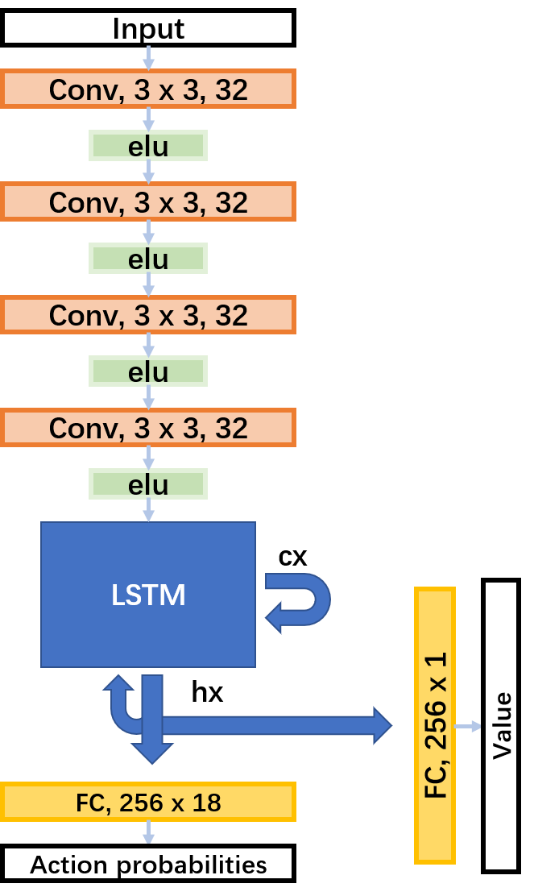

#	Technical report

[TOC]

Team: 

* 龚平，Ping Gong，PB17030808，贡献55%
* 罗极羽，Jiyu Luo，PB17111656，贡献45%

note: 

* 本文档使用`Typora`撰写，其他markdown解释器可能存在编译错误。
* 本项目以上传github，并将于19号00：00开放。

## Layer Design

在本实验中，使用了四种网络结构:

**Conv2d**、**Linear**、**LSTM**、**elu**

### Conv2d

* forward 原理 & 实现

  直接将输入图像与卷积核进行[二维卷积](https://baike.baidu.com/item/卷积神经网络)

  利用[conv2d](https://pytorch.org/docs/stable/nn.functional.html#conv2d)来实现卷积运算：

  ```
  F.conv2d(input, self.weight, self.bias, self.stride,
                          self.padding, self.dilation, self.groups)
  ```

* backward 原理

  用一个[简单的例子](http://staff.ustc.edu.cn/~jwangx/classes/210709/notes/Lec10.pdf)说明其原理（暂不考虑stride，下文补充）:

  

  ***首先求 $E$ 对权重 $F$ 的梯度***：
  $$
  \frac{\partial E}{\partial F_{11}} = \frac{\partial E}{\partial \mathbf{O}}^{\top}\frac{\partial \mathbf{O}}{\partial F_{11}}​= \frac{\partial E}{\partial O_{11}}X_{11}+\frac{\partial E}{\partial O_{12}}X_{12}+\frac{\partial E}{\partial O_{21}}X_{21}+\frac{\partial E}{\partial O_{22}}X_{22}
  $$

  以此类推，可以看出， $E$ 对权重 $F$ 的梯度也可以通过卷积运算求出

  

  ***同理，考虑  $E$ 对输入 $X$ 的梯度***：
  $$
  \frac{\partial E}{\partial X_{11}} = \frac{\partial E}{\partial \mathbf{O}}^{\top}\frac{\partial \mathbf{O}}{\partial X_{11}}​= \frac{\partial E}{\partial O_{11}}F_{11}+\frac{\partial E}{\partial O_{12}}0+\frac{\partial E}{\partial O_{21}}0+\frac{\partial E}{\partial O_{22}}0
  $$
  以此类推，我们发现可以将卷积核（权重$F$）旋转180°，并与 $\frac{\partial E}{\partial \mathbf{O}}$ （补0）进行卷积从而得到结果
  

  

  ***而当$stride>1$ 时***，需要将原本的卷积操作换为[空洞卷积](https://www.jianshu.com/p/f743bd9041b3)，dilation 的值即为 stride（将卷积核设为为$1\times1$即可证明）

  


* backward 实现

  记$O$为卷积结果，$W$为权重（卷积核），$X$为输入，$b$为偏置

  ***权重的梯度：***通过[F.conv2d](https://pytorch.org/docs/stable/nn.functional.html#conv2d)来实现卷积运算（设置空洞dilation）

  ***输入的梯度：***通过反卷积函数[conv_transpose2d](https://pytorch.org/docs/stable/nn.functional.html#conv-transpose2d)实现（反卷积的理解参考[这里](https://www.zhihu.com/question/48279880)，原理上文已描述过）

  ```
  conv_for_back = F.conv_transpose2d(top_grad_t, self.weight,torch.zeros(self.in_channels), self.stride, self.padding,				(self.input[i].shape[2]-top_grad.shape[2])%2, self.groups,self.dilation)
  ```

  ***偏置的梯度：***直接求和即可。
$$
  \frac{\partial Loss}{\partial b} = \sum \frac{\partial Loss}{O_{ij}}
$$

### Linear

* forward 原理 & 实现

  $$
  \mathbf{y} = \mathbf{x}W^{\top}+b
  $$
  利用[F.linear](https://pytorch.org/docs/stable/nn.functional.html#linear)函数即可

* backward 原理 & 实现

  ***权重的梯度：***
  $$
  \frac{\partial Loss}{\partial W} = \frac{\partial Loss}{\partial \mathbf{y}}^{\top}\mathbf{x}
  $$
  ***偏置的梯度：***
  $$
  \frac{\partial Loss}{\partial \mathbf{b}} = \frac{\partial Loss}{\partial \mathbf{y}}
  $$
  ***输入的梯度：***
  $$
  \frac{\partial Loss}{\partial \mathbf{x}} = \frac{\partial Loss}{\partial \mathbf{y}}\mathbf{W}
  $$
  以上梯度只需通过$torch.matmul$, $torch.add$函数即可求出。

  

### LSTM

在使用深度学习处理时序问题时，RNN时最常使用的模型之一。RNN能够有效的将之前的时间片信息用于计算当前时间片的输入。其中Long Short Term Memory (LSTM)是一种常见且有效的神经网络。由于`Riverraid-v0`虽然`action`是离散的，但是其状态在时间尺度上有非常强的相关性，所以考虑使用LSTM进行训练，能取得不错的成果。


假设对`t`轮，对LSTM输入为$\mathbf{x}_t$，$\mathbf{h}_{t-1}$、$\mathbf{c}_{t-1}$，下面我们考虑$Forward$和$Backward$

* Forward

  LSTM内部由四个门构成，涉及到五个运算，分别是向量元素乘、向量和、$tanh$、$\sigma$ 以及四个门电路	

  对	$tanh(\mathbf{x}) = \frac{e^{x} - e^{-x}}{e^{x} + e^{-x}} = \frac{e^{2x} - 1}{e^{2x} + 1} = \frac{1 - e^{-2x}}{1+ e^{-2x}}$, 对$\tanh$计算同样存在上溢或者下溢的问题。因此对正数，我们倾向于使用$\frac{1 - e^{-2x}}{1+ e^{-2x}}$计算；对于负数，我们倾向于使用$\frac{e^{x} - e^{-x}}{e^{x} + e^{-x}}$以提高计算精度

  ```python
  		#伪代码
  		if x > 0:
  		    tanh = (1 - exp(-2 * x)) / (1 +  exp(-2 * x))
  		else:
  		    tanh = (exp(2 * x) - 1) / (exp(2 * x) + 1)
  		    
  		#实际代码
  		def tanh(value):
  		    value = value.double()
  		    e_p = torch.exp(value.mul(2))
  		    e_n = torch.exp(value.mul(-2))
  		    tanh_n = (e_p - 1) / (e_p + 1)
  		    tanh_p = (1 - e_n) / (1 + e_n)
  		    return torch.where(value > 0, tanh_p, tanh_n).float()
  ```

  对 $\sigma(x) = \frac{e^{x}}{1 + e^{x}}$同样也存在这个问题，因而我们要区分正负数，进行单独计算，以提高精度

  ```python
  		def sigmoid(value):
  		    value = value.double()
  		    sigmoid_value_p = torch.exp(-value).add(1).pow(-1)
  		    exp_value = torch.exp(value)
  		    sigmoid_value_n = exp_value.div(exp_value.add(1))
  		    return torch.where(value > 0, sigmoid_value_p, sigmoid_value_n).float()
  ```

  完成上诉设计，即可完成LSTM $Forward$设计，四个门:

  

  因此对当前LSTM最终输出为：

  

  ```python
  		def forward(input, hidden):
  		    hx, cx = hidden
  		    gates = F.linear(input, w_ih, b_ih) + F.linear(hx, w_hh, b_hh)
  		    ingate, forgetgate, cellgate, outgate = gates.chunk(4, 1)
  		    ingate     = F.sigmoid(ingate)
  		    forgetgate = F.sigmoid(forgetgate)
  		    cellgate   = F.tanh(cellgate)
  		    outgate    = F.sigmoid(outgate)
  		    cy = (forgetgate * cx) + (ingate * cellgate)
  		    hy = outgate * F.tanh(cy)
  		    return hy, cy
  ```

* Backward

  对LSTM backward相对而言就要非常复杂了，首先我们先对$\sigma$和$tanh$两个函数完成其对应的求导

  $\frac{\partial\sigma(x)}{\partial x} = \sigma(x) (1 - \sigma(x))$

  $\frac{\partial tanh{(x)}}{\partial x} = 1 - tanh^2{(x)}$

  根据LSTM前向传播计算LSTM的方向传播:
  
  
  
  最终我们更新的权重为：
  
  
  
  实现部分非常长，这里仅放实现代码的链接 [LSTM backward](https://github.com/gpzlx1/ML/blob/master/A3C/layers.py#L292)

### elu

激活函数elu非常简单

* Forward:
  $$
  f(x) = \begin{cases} x, &\text{if } x >0; \\  \alpha(\exp{(x)} - 1) & \text{if } x \leq 0\end{cases}
  $$

* Backward:
  $$
  \frac{\partial f(x)}{\partial x} = \begin{cases} 1, &\text{if } x >0; \\  \alpha\exp{(x)}& \text{if } x \leq 0\end{cases}
  $$
  在本实验，使用 $\alpha = 1$.


## Algothrim --A3C

### intro & theory

A3C,即 Asynchronous advantage actor-critic，异步优势动作评价算法。在具体了解A3C前，我们要先了解一下Actor-Critic 框架和A2C 算法。

* *DQN vs A3C*

  较为复杂的游戏中，DQN一次只能探索很少的空间，从而更新Q值的速度很慢，需要很长时间的训练才能达到不错的表现。

  

  相比之下，A3C算法将policy-base和value-based相结合，一方面避免了蒙特卡洛算法（policy-based）方差较大的问题，另一方面在训练效果和速度上也优于DQN（value-based）。

  

* **Actor-Critic**

  Actor-Critic 包括两部分：Actor 负责生成动作(Action)并和环境交互。而Critic负责评估Actor的表现，并指导Actor下一阶段的动作。

  

  Actor（policy based）：即策略$\pi(a|s)$，我们用神经网络进行近似（s = state，a = action）
  $$
  \pi_\theta(s,a) \approx \pi(a|s)
  $$
  

  Critic（value based）：即价值函数$v_\pi(s)$和$q_\pi(s,a)$，同样用神经网络近似
  $$
  v(s,w) \approx v_\pi(s)\\
  q(s,a,w) \approx q_\pi(s,a)
  $$
  

  

  **接下来考虑如何对参数进行更新，来优化策略**

  

  假设需要优化的目标是当前策略下，初始状态reward的期望：
  $$
  \rho(\pi) = E(\sum_{t=1}^{\infty}\gamma^{t-1}r_t\mid s_0,\pi )
  $$
  我们有如下结论（证明见此[论文](https://homes.cs.washington.edu/~todorov/courses/amath579/reading/PolicyGradient.pdf)），其中$Q^\pi(s,a)$可以取不同的价值函数:
  $$
  \frac{\partial \rho}{\partial \theta} = \sum_s d^{\pi}(s)\sum_a \frac{\partial \pi_\theta(s,a)}{\partial \theta}Q^\pi(s,a)
  $$
  再由等式$\frac{\partial \pi_\theta(s,a)}{\partial \theta} = \pi_\theta(s,a)\nabla_\theta\log\pi_\theta(s,a)$ 可得
  $$
  \frac{\partial \rho}{\partial \theta} = \mathbb{E}_{\pi_\theta}[\nabla_\theta\log\pi_\theta(s,a)Q^\pi(s,a)]
  $$
  

  因此，策略的参数更新公式为
  $$
  \theta = \theta +  \alpha\nabla_\theta\log\pi_\theta(s,a)Q^\pi(s,a)
  $$
  
* A2C (Advantage Actor Critic)

  在上述框架中，采用优势函数 $A_\pi(s,a) = Q_\pi(s,a)-V_\pi(s)$ 作为 Critic的价值函数，就得到A2C算法。从而策略的更新公式变为
  $$
  \theta = \theta +  \alpha\nabla_\theta\log\pi_\theta(s,a)A_\pi(s,a)
  $$
  

  

  ***A2C vs AC***:

  当优势函数大于0 ，说明此该动作优于平均动作，反之则不如平均动作。这样可以更好的处理动作价值函数全正或者全负的情况。

  相较于累计回报，优势函数的方差会更小。


* A3C的改进和具体算法

  在传统的A2C上，A3C采用了异步的方式，从而打破数据间的相关性，解决了AC算法难以收敛的问题：

  

  ​		下面是A3C的伪代码

### Model Design

本小结将解释模型是如何设计的，整个模型如下图所示，共有七层。



由于输入的state，实际上是图像信息，因而我们使用四层卷积层，来提取图片的信息，并使用`elu`作为激活函数。

```python
        x = F.elu(self.conv1.forward(inputs))
        x = F.elu(self.conv2.forward(x))
        x = F.elu(self.conv3.forward(x))
        x = F.elu(self.conv4.forward(x))
```

考虑到，输入的state变化在时间尺度上有非常高的关联性，我们采用`LSTM`来提取时间尺度上的变化特征，使得网络能更好的提取state的特征。

```python
		x = x.view(-1, 32 * 3 * 3)
        hx, cx = self.lstm.forward(x, (hx, cx))
```

最后是采用两个全连接层，其中一个输出`action advantage value`，另外一个输出`state value`。

```python
		#state value
    	self.critic_linear.forward(x)
        #advantage value
		self.actor_linear.forward(x)
```

在前向传播过程中，我们要保存一些中间结果，这里就不展示这部分结构了。

整个模型forward过程为：

```python
		def forward(self, inputs):
		        inputs, (hx, cx) = inputs
		        x = F.elu(self.conv1.forward(inputs))
		        x = F.elu(self.conv2.forward(x))
		        x = F.elu(self.conv3.forward(x))
		        x = F.elu(self.conv4.forward(x))
		        # x.shape = 1, 32, 3, 3
		        x = x.view(-1, 32 * 3 * 3)
		        # x.shape = 1, 288
		        hx, cx = self.lstm.forward(x, (hx, cx))
		        x = hx
		        return self.critic_linear.forward(x), self.actor_linear.forward(x), (hx, cx)
```

由于我们已经完成各层反向传播的计算，所以对模型的反向传播直接为各层的组装：

```python
		def backward(self, top_grad_value, top_grad_logit):
		        grad_inputs = []
		
		        grad_critic_linear = self.critic_linear.backward(top_grad_value)
		        grad_actor_liner = self.actor_linear.backward(top_grad_logit)
		
		        top_grad_h = []
		
		        for i in range(len(grad_critic_linear)):
		            top_grad_h.append(grad_critic_linear[i] + grad_actor_liner[i])
		
		        top_grad_c = [0] * len(grad_critic_linear)
		
		        top_grad_conv4, _, _ = self.lstm.backward(top_grad_h, top_grad_c)
		
		        top_grad_conv4 = [element.view(-1, 32, 3, 3) for element in top_grad_conv4]
		
		        top_grad_conv4 = grad_elu(top_grad_conv4, self.y4)
		        top_grad_conv3 = self.conv4.backward(top_grad_conv4)
		
		        top_grad_conv3 = grad_elu(top_grad_conv3, self.y3)
		        top_grad_conv2 = self.conv3.backward(top_grad_conv3)
		
		        top_grad_conv2 = grad_elu(top_grad_conv2, self.y2)
		        top_grad_conv1 = self.conv2.backward(top_grad_conv2)
		
		        top_grad_conv1 = grad_elu(top_grad_conv1, self.y1)
		        grad_inputs = self.conv1.backward(top_grad_conv1)
		
		        return grad_inputs
```

### Inputs Normalization

由于输入的是图像信息，具有高度信息冗余，所以我们需要对图像进行一定操作，提高信息密度减少计算量，并规约化，核心操作为

1. crop & resize

   首先先裁掉边框信息，然后分两次resize，以提高保留的信息密度

   ```python
   	frame = frame[34:34 + 160, :160]
       frame = cv2.resize(frame, (80, 80))
       frame = cv2.resize(frame, (42, 42))
   ```

2. channel merge

   同时由于图像是RGB图像，我们并不需要颜色信息，因而可以对channel进行合并，减小计算量

   ```python
   	frame = frame.mean(2, keepdims=True)
   ```

3.  normalize

   我们需要将输入数据调整为正态分布，但是由于并不清楚，总体方差和平均值是多少，因而我们采用采样估计的策略。

   ```python
   	frame *= (1.0 / 255.0)
       
       class NormalizedEnv(gym.ObservationWrapper):
       	def __init__(self, env=None):
       	    super(NormalizedEnv, self).__init__(env)
       	    self.state_mean = 0
       	    self.state_std = 0
       	    self.alpha = 0.9999
       	    self.num_steps = 0
   	
       	def observation(self, observation):
       	    self.num_steps += 1
               #更新均值
       	    self.state_mean = self.state_mean * self.alpha + \
       	        observation.mean() * (1 - self.alpha)
       	    #更新标准差
               self.state_std = self.state_std * self.alpha + \
       	        observation.std() * (1 - self.alpha)
   	
       	    unbiased_mean = self.state_mean / (1 - pow(self.alpha, self.num_steps))
       	    unbiased_std = self.state_std / (1 - pow(self.alpha, self.num_steps))
   	
       	    return (observation - unbiased_mean) / (unbiased_std + 1e-8)
   ```

   

### Reward design

根据[Welcome to Deep Reinforcement Learning Part 1 : DQN](https://towardsdatascience.com/welcome-to-deep-reinforcement-learning-part-1-dqn-c3cab4d41b6b)采用Clipping rewards 设计可以提高模型性能，由于`Riverraid-v0`中reward全为非负，因而我们可以clip reward为 0 和 1。

```python
 		reward = max(min(reward, 1), -1)
```

### Loss Compute

$reward_i$ 为单步的reward；$v_i$为Critic得到的预估价值；$logprob_i$为选择的action的概率的对数（经过softmax和log处理）
$$
Loss = L_{value}+L_{policy}
$$
首先获得一个episode(n步)中每个state的预期Reward：
$$
R_k = \sum_{i=k}^n \gamma^{i-k} reward_i
$$
然后得到$L_{value}$：
$$
L_{value} = \alpha_{value} \frac{1}{2}\sum_{i=1}^{n}(R_i-v_i)^2
$$
接着计算单步优势函数：
$$
\Delta_i = reward_i + \gamma v_{i+1}-v_i
$$
和每个state的优势函数：
$$
gae_k = \sum_{i=1}^{n} (\lambda\gamma)^{k-i}\Delta_i
$$
最后得到$L_{policy}$（对应上文提到的参数更新公式）：
$$
L_{policy} = - \sum_{i=1}^{n}gae_i*logprob_i
$$
考虑到平衡action，避免过于集中，我们引入第i步policy的熵$Entropy_i$，最终得到
$$
L_{policy} = - \sum_{i=1}^{n}gae_i*logprob_i - \alpha_{entropy}\sum_{i=1}^{n}Entropy_i
$$

$$
Loss = L_{value}+L_{policy} =\alpha_{value} \frac{1}{2}\sum_{i=1}^{n}(R_i-v_i)^2- \sum_{i=1}^{n}gae_i*logprob_i - \alpha_{entropy}\sum_{i=1}^{n}Entropy_i
$$


* Loss backward

  以单步为例，最后求和即可

  记$value$ 为$Critic$估计的value值，$logit$为$Actor$估计得到的policy

  我们只需求得$\frac{\partial L}{\partial \mathbf{value}}$和$\frac{\partial L}{\partial \mathbf{logit}}$

  事实上，这只涉及最基础的求导，具体的公式的推导可以参考[这里P41](http://staff.ustc.edu.cn/~jwangx/classes/210709/notes/Lec09.pdf)

  首先我们有
  $$
  p_i =\frac{e^{logit_i}}{\sum_{k}e^{logit_k}}
  $$
  
  $$
  logprob = log(p_i)
  $$
  所以
  $$
  \frac{\partial logprob}{\partial logit_j} = \begin{cases}
  1-p_i & i=j\\
  -p_j& i\neq j
  \end{cases}
  $$
  Entropy同理

### Update Gradient

我们使用`Adam`优化器进行梯度更新：

算法伪代码：


实现过程参考[torch.optim.adam](https://github.com/pytorch/pytorch/blob/6e2bb1c05442010aff90b413e21fce99f0393727/torch/optim/adam.py)，实现部分为[my_optim.py](https://github.com/gpzlx1/ML/blob/master/A3C/my_optim.py)

### Others

整个目录结构如下：

```shell
├── A3C						#A3C实现代码
│   ├── envs.py				#处理输入数据
│   ├── layers.py			#每层网络设计
│   ├── my_main.py			
│   ├── my_model.py			#模型设计
│   ├── my_optim.py			#optimizer实现
│   ├── my_test.py			#测试进程	
│   └── my_train.py			#训练进程
├── PB17111656.py			#对外测试接口
├── figures
├── log						#训练日志存放
├── model					#model存放
├── report.md
├── requirement.txt
├── rl_configs.py
└── todo.txt
```

超参数设计（参考[pytorch-a3c](https://github.com/ikostrikov/pytorch-a3c)）：

```python
	class config(object):
	    def __init__(self):
	        self.lr = 0.0001						#学习率
	        self.gamma = 0.99						#A3C 计算loss所用参数
	        self.gae_lambda = 1.00
	        self.entropy_coef = 0.01
	        self.value_loss_coef = 0.5
	        self.max_grad_norm = 50					#用于clip gradient, 以防梯度爆炸
	        self.seed = 1
	        self.num_processes = 23					#训练使用进程
	        self.num_steps = 20						#每num_steps个acitons, 训练进程对中心模型进行一次参数更新
	        self.max_step_length = 1000000			#最大训练步长
	        self.env_name = 'Riverraid-v0'			#训练任务
	        self.model_path = './model/'			#模型存储位置
	        self.test_interval = 20					#测试进程每隔20秒，测试一次当前中心模型性能
```

## Result

A3C具有优秀的训练速度和性能，训练二十四小时即可完成收敛，平均100-episode reward为10000+。


单局演示：


## Reference

https://medium.com/@aidangomez/let-s-do-this-f9b699de31d9

[https://baike.baidu.com/item/卷积神经网络](https://baike.baidu.com/item/卷积神经网络)

[https://pytorch.org/docs/stable/nn.functional.html](https://pytorch.org/docs/stable/nn.functional.html)

[http://staff.ustc.edu.cn/~jwangx/classes/210709/notes/Lec10.pdf](http://staff.ustc.edu.cn/~jwangx/classes/210709/notes/Lec10.pdf)

[https://www.jianshu.com/p/f743bd9041b3](https://www.jianshu.com/p/f743bd9041b3)

[https://www.zhihu.com/question/48279880](https://www.zhihu.com/question/48279880)


[https://homes.cs.washington.edu/~todorov/courses/amath579/reading/PolicyGradient.pdf](https://homes.cs.washington.edu/~todorov/courses/amath579/reading/PolicyGradient.pdf)

[https://zhuanlan.zhihu.com/p/62100741](https://zhuanlan.zhihu.com/p/62100741)

[https://www.cnblogs.com/pinard/p/10272023.html](https://www.cnblogs.com/pinard/p/10272023.html)

[https://www.cnblogs.com/wangxiaocvpr/p/8110120.html](https://www.cnblogs.com/wangxiaocvpr/p/8110120.html)


[http://staff.ustc.edu.cn/~jwangx/classes/210709/notes/Lec09.pdf](http://staff.ustc.edu.cn/~jwangx/classes/210709/notes/Lec09.pdf)

[https://hackernoon.com/intuitive-rl-intro-to-advantage-actor-critic-a2c-4ff545978752](https://hackernoon.com/intuitive-rl-intro-to-advantage-actor-critic-a2c-4ff545978752)

[pytorch-a3c](https://github.com/ikostrikov/pytorch-a3c)

[torch.optim.adam](https://github.com/pytorch/pytorch/blob/6e2bb1c05442010aff90b413e21fce99f0393727/torch/optim/adam.py)

[Welcome to Deep Reinforcement Learning Part 1 : DQN](https://towardsdatascience.com/welcome-to-deep-reinforcement-learning-part-1-dqn-c3cab4d41b6b)